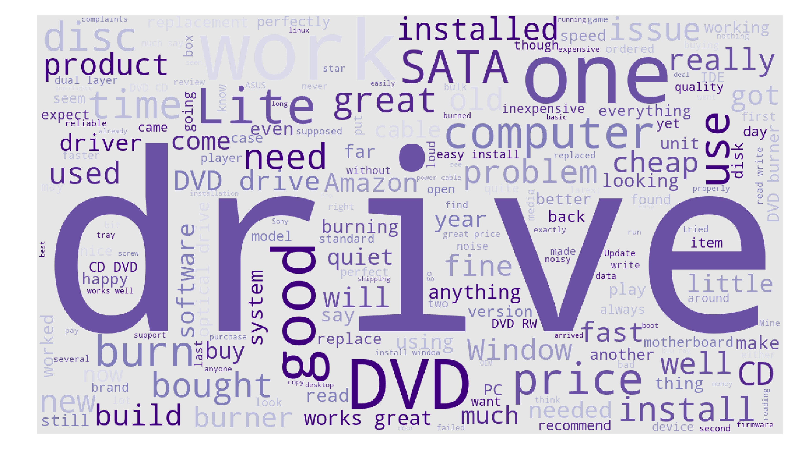
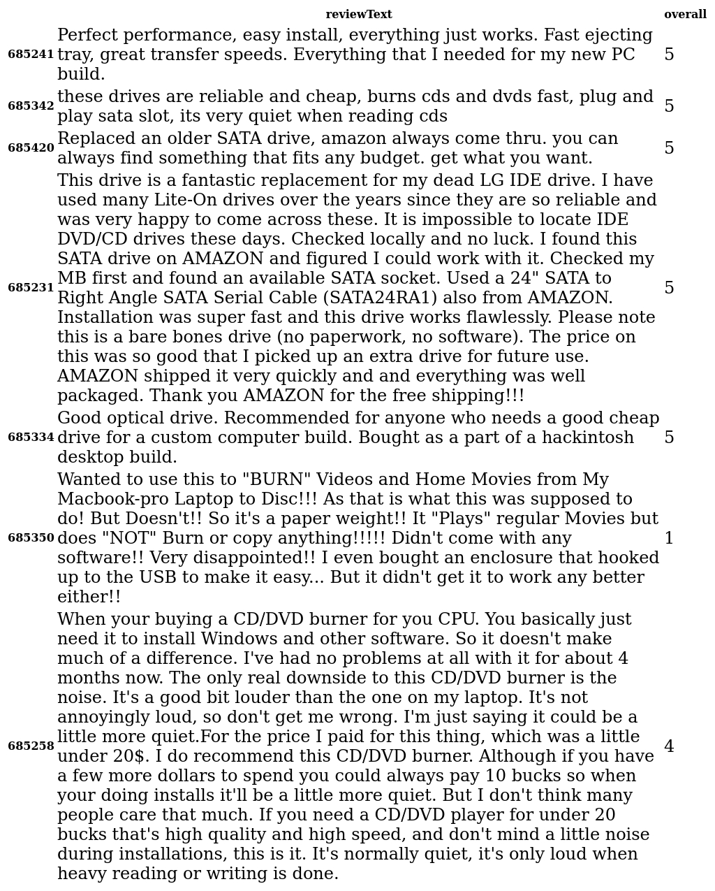

# unsupervised-text-summarization
Summarize Amazon product reviews using non-convex entropy minimization. The basic idea is to select a few representative reviews that fully characterize the product features. This can be done by looking for a sparse representation of the entire dataset in an appropriate dictionary under some carefully designed criteria. This sparse representation then corresponds to the selected representatives.  

#### Rating histogram of an Amazon product

#### Word-counting based summarization techniques lack of physical context

#### The representative reviews (below) chosen by the proposed algorithm not only represent key features of the product but also offer physical context, e.g., written by real users, which is lacked in word-counting based techniques such as PCA.

### References
DN Tran, SP Chin, TD Tran, *"A provable nonconvex model for factoring nonnegative matrices"*, ICASSP (2017).
